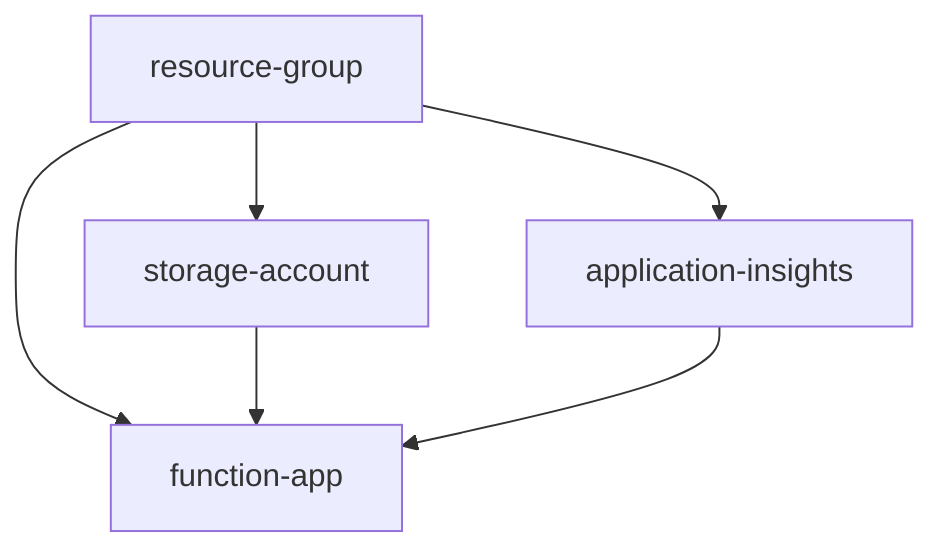

# Terraform Modules for Metrc API Function App

This directory contains reusable Terraform modules that follow infrastructure as code best practices. Each module is designed to be self-contained, testable, and reusable across different environments.

## 📁 Module Structure

```
modules/
├── resource-group/                    # Azure Resource Group management
│   ├── resource-group.tf             # Resource Group definitions
│   ├── variables.tf                  # Input variables
│   └── outputs.tf                    # Output values
├── storage-account/                   # Azure Storage Account for Function App
│   ├── storage-account.tf            # Storage account configuration
│   ├── variables.tf                  # Storage-specific variables
│   └── outputs.tf                    # Storage account outputs
├── application-insights/              # Azure Application Insights for monitoring
│   ├── application-insights.tf       # Application Insights configuration
│   ├── variables.tf                  # Monitoring-specific variables
│   └── outputs.tf                    # Application Insights outputs
└── function-app/                     # Azure Function App with App Service Plan
    ├── function-app-with-service-plan.tf  # Function App and Service Plan
    ├── variables.tf                  # Function App variables
    └── outputs.tf                    # Function App outputs
```

## 🏗️ Module Descriptions

### 1. Resource Group Module (`resource-group/`)

**Purpose**: Creates and manages Azure Resource Groups.

**Resources Created**:
- `azurerm_resource_group`

**Key Features**:
- Configurable location and naming
- Consistent tagging support
- Simple and reusable across projects

**Usage**:
```hcl
module "resource_group" {
  source = "./modules/resource-group"
  
  name     = "my-app-dev-rg"
  location = "East US"
  tags = {
    Environment = "dev"
    Project     = "my-app"
  }
}
```

### 2. Storage Account Module (`storage-account/`)

**Purpose**: Creates Azure Storage Account optimized for Azure Functions.

**Resources Created**:
- `azurerm_storage_account`

**Key Features**:
- Security hardened (TLS 1.2, no public nested items)
- Configurable replication and tier
- Optional deletion protection
- Cost-optimized defaults (LRS, Standard tier)

**Usage**:
```hcl
module "storage_account" {
  source = "./modules/storage-account"
  
  name                       = "myappdevsa1234"
  resource_group_name        = module.resource_group.name
  location                   = module.resource_group.location
  enable_deletion_protection = true
  tags                       = local.common_tags
}
```

### 3. Application Insights Module (`application-insights/`)

**Purpose**: Creates Azure Application Insights for monitoring and observability.

**Resources Created**:
- `azurerm_application_insights`

**Key Features**:
- Configurable retention period
- Web application type optimized for Function Apps
- Optional deletion protection
- Integration ready for Function Apps

**Usage**:
```hcl
module "application_insights" {
  source = "./modules/application-insights"
  
  name                       = "my-app-dev-ai"
  resource_group_name        = module.resource_group.name
  location                   = module.resource_group.location
  retention_in_days          = 90
  enable_deletion_protection = true
  tags                       = local.common_tags
}
```

### 4. Function App Module (`function-app/`)

**Purpose**: Creates Azure Function App with App Service Plan (Consumption).

**Resources Created**:
- `azurerm_service_plan` (Consumption plan)
- `azurerm_windows_function_app`
- `azurerm_windows_function_app_slot` (optional staging slot)

**Key Features**:
- PowerShell 7.4 runtime configured
- Consumption plan for serverless execution
- Application Insights integration
- CORS configuration for web clients
- Optional staging slot for blue-green deployments
- Managed identity enabled
- Optional deletion protection

**Usage**:
```hcl
module "function_app" {
  source = "./modules/function-app"
  
  name                             = "my-app-dev-func-1234"
  resource_group_name              = module.resource_group.name
  location                         = module.resource_group.location
  storage_account_name             = module.storage_account.name
  storage_account_access_key       = module.storage_account.primary_access_key
  app_insights_instrumentation_key = module.application_insights.instrumentation_key
  app_insights_connection_string   = module.application_insights.connection_string
  
  app_settings = {
    "MY_CUSTOM_SETTING" = "value"
  }
  
  enable_deletion_protection = true
  enable_staging_slot       = false
  tags                      = local.common_tags
}
```

## 🔧 Module Best Practices

### 1. Variable Validation

All modules include input validation where appropriate:

```hcl
variable "retention_in_days" {
  description = "Data retention period in days"
  type        = number
  default     = 90
  
  validation {
    condition     = var.retention_in_days >= 30 && var.retention_in_days <= 730
    error_message = "Retention period must be between 30 and 730 days."
  }
}
```

### 2. Sensitive Data Handling

Sensitive outputs are properly marked:

```hcl
output "instrumentation_key" {
  description = "Instrumentation key for Application Insights"
  value       = azurerm_application_insights.this.instrumentation_key
  sensitive   = true
}
```

### 3. Lifecycle Management

Critical resources include deletion protection:

```hcl
lifecycle {
  prevent_destroy = var.enable_deletion_protection
}
```

### 4. Consistent Naming

Resources use consistent naming patterns:

```hcl
resource "azurerm_service_plan" "this" {
  name = "${var.name}-plan"
  # ... other configuration
}
```

## 🧪 Testing Modules

### Individual Module Testing

Test each module independently:

```bash
# Test resource group module
cd modules/resource-group
terraform init
terraform plan -var="name=test-rg" -var="location=East US"

# Test storage account module
cd modules/storage-account
terraform init
terraform plan \
  -var="name=testsa1234" \
  -var="resource_group_name=test-rg" \
  -var="location=East US"
```

### Integration Testing

Test complete module integration:

```bash
# From terraform root directory
terraform init
terraform plan
terraform apply -auto-approve
terraform destroy -auto-approve
```

## 📋 Module Dependencies



**Dependency Order**:
1. `resource-group` (no dependencies)
2. `storage-account` (depends on resource-group)
3. `application-insights` (depends on resource-group)
4. `function-app` (depends on resource-group, storage-account, application-insights)

## 🔄 Module Versioning

For production use, consider module versioning:

```hcl
module "function_app" {
  source = "git::https://github.com/yourorg/terraform-modules.git//function-app?ref=v1.0.0"
  # ... configuration
}
```

## 📝 Module Documentation Standards

Each module follows this documentation structure:

1. **Purpose**: What the module does
2. **Resources**: What Azure resources are created
3. **Variables**: Required and optional inputs
4. **Outputs**: What values are exposed
5. **Examples**: Usage examples
6. **Notes**: Special considerations

## 🔐 Security Considerations

### Access Control

Modules follow least-privilege principles:
- Managed identities where possible
- No hardcoded secrets
- Sensitive data properly handled

### Network Security

Default secure configurations:
- HTTPS only for Function Apps
- TLS 1.2 minimum for Storage Accounts
- CORS properly configured

### Data Protection

- Deletion protection for critical resources
- Backup considerations documented
- Compliance with data retention policies

## 🚀 Contributing to Modules

### Adding New Modules

1. Create module directory structure
2. Follow naming conventions
3. Include comprehensive variables.tf
4. Provide clear outputs.tf
5. Add examples and documentation
6. Test thoroughly

### Modifying Existing Modules

1. Maintain backward compatibility
2. Update version numbers
3. Test with existing implementations
4. Update documentation
5. Consider migration paths

This modular approach provides better maintainability, reusability, and testability for your infrastructure code.
